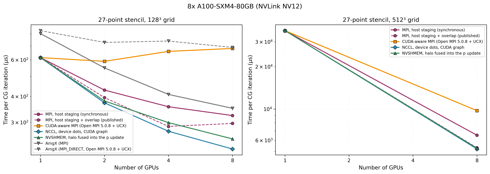

# Communication Backends: Host Staging, CUDA-aware MPI, NCCL, NVSHMEM

The 3D solver moves two kinds of data between GPUs at every CG iteration: one XY-plane of `p` to each
Z-neighbour (the halo), and two scalars summed over all ranks (the dot products `p·Ap` and `r·r`, on
which α and β depend). This page compares four ways of doing it, on the same algorithm and the same
partition, and shows where each one spends its time.

<p align="center">
  
</p>

## 1. The four backends

`--comm=MODE` on `cg_solver_mgpu_stencil_3d` selects how the halo moves; the solver and its numerics
are the same for all four.

| Backend | Halo path | Host synchronizations per halo |
|---|---|---|
| `staged` (default; the backend of the scaling and AmgX results) | device → pinned host → MPI → pinned host → device | 2 |
| `gpuaware` | device pointers handed to a CUDA-aware MPI | 1 (MPI does not know CUDA streams) |
| `nccl` | `ncclSend`/`ncclRecv` to both neighbours in one group, enqueued on the solver's stream | 0 |
| `nvshmem` | one-sided puts into the neighbour's symmetric memory with a signal, ordered on the stream | 0 |

Options that change what the iteration synchronizes, independently of the halo backend:

- `--dots=device` keeps the CG scalars on the GPU: `cublasDdot` writes to device memory, the sum over
  ranks is enqueued on the stream (NCCL, NVSHMEM) and the BLAS1 kernels read α and β from device
  memory. The host reads `r·r` only to test convergence, every `--check-every=K` iterations.
- `--graph` (NCCL, device dots) replays K iterations as one CUDA graph.
- `--fused-halo` (NVSHMEM): the kernel that computes `p = r + βp` also stores its boundary planes
  directly into the neighbours' halo buffers, followed by one signal per neighbour.
- `--overlap` runs the interior/boundary split of [`profiling-3d.md`](profiling-3d.md) with any backend.

NCCL and NVSHMEM are optional at build time (`NCCL_HOME`, `NVSHMEM_HOME`); a build without them keeps
the other backends.

## 2. Correctness before timing

Every configuration reproduces the residual history of the staged reference bit for bit at a fixed
iteration count (`--verbose=3` prints `r·r` in hexadecimal). A halo only moves bytes, so any
difference is a bug. The one legitimate exception is a device-side sum over three or more ranks by
NCCL or NVSHMEM, whose summation order differs from MPI's; there the relative deviation of `r·r` stays
below 1e-10 (measured: 2.7e-13 to 3.6e-13). `scripts/benchmarking/comm_preflight.sh` runs this check
for every backend and mode at 1, 2, 4 and 8 ranks; on the node below, 52 of 52 configurations passed.

Library setup is not timed: communicators are created once per process, and each solve exercises every
send/receive buffer pair before its start event.

## 3. Measurement setup

Sections 4 and 6: measured on 5 October 2026, solver code at commit `c29dea7` (PR #23). Section 5 and the
Open MPI and placement comparisons below: 1 and 2 October 2026, solver code at commit `a485963` (branch
`p3/comm-backends`), same node; the per-iteration counts of section 5 were measured again on 5 October and
are identical.

- **Node**: 8× NVIDIA A100-SXM4-80GB, NVLink NV12 between every GPU pair (HGX board, NVSwitch),
  driver 580.65.06. 2× AMD EPYC 7532, 8 NUMA nodes; each GPU pair is local to one of them.
- **Software**: CUDA 12.8 (cuBLAS 12.8.4.1, cuSPARSE 12.5.8.93), NCCL 2.31.2, NVSHMEM 3.7.2, AmgX
  `cc1cebd`, Nsight Systems 2024.6.2.
- **MPI, per backend**: `staged`, `nccl`, `nvshmem` and AmgX with its `MPI` communicator run under the
  system Open MPI 4.1.6, the library of the other published results. `gpuaware` and AmgX
  `MPI_DIRECT` need a CUDA-aware MPI and run under Open MPI 5.0.8 + UCX 1.18.1 built with CUDA.
  The CUDA-aware build changes the staged path's time with identical kernels: 323.9 µs per iteration
  under Open MPI 4.1.6, 461.9 µs under Open MPI 5.0.8 (27-point, 128³, 8 GPUs). NCCL with device dots,
  which calls no MPI inside the loop, ran 232.2 and 233.4 µs. The share of that overhead carried by the
  `gpuaware` column was not measured.
- **Placement**: each rank is bound to CPU cores local to its GPU (`make_rankfile.sh`). On this node,
  unbound ranks ran the 27-point 256³ solve on 8 GPUs in 526 ms, bound ranks in 327 ms.
- **Protocol**: each configuration is the median of 5 timed solves, capped at 300 iterations, and every
  time is divided by the run's own iteration count. At 512³ every run reaches the cap. At 128³ the
  solver converges first: 151 iterations, 160 with device dots (which test convergence every 10).
  AmgX is given an unreachable tolerance (1e-300) to run a fixed number of iterations, and reports
  convergence after 231 at 128³; at the same tolerance as the Custom CG (1e-6), both take 151 (see
  [`results.md`](results.md#3d-custom-cg-vs-nvidia-amgx-27-point)). Every backend follows the same
  residual history (section 2), so the time per iteration compares the same work.

## 4. Results

Time per CG iteration (µs), 27-point stencil; speedup over `staged` in brackets. Raw data:
[`data/comm_backends_a100/`](https://github.com/sbouhrour/mgpu-cg-stencil-solver/tree/main/docs/data/comm_backends_a100), table produced by
`scripts/benchmarking/comm_table.py`.

| Configuration | 128³, 2 GPUs | 128³, 4 GPUs | 128³, 8 GPUs | 512³, 8 GPUs |
|---|---:|---:|---:|---:|
| `staged`, host dots | 429.6 | 356.6 | 324.0 | 6444.1 |
| `staged`, overlap | 395.9 (1.09×) | 286.9 (1.24×) | 295.3 (1.10×) | 5279.0 (1.22×) |
| `nccl`, host dots | 388.6 (1.11×) | 284.2 (1.25×) | 233.7 (1.39×) | 5269.6 (1.22×) |
| `nccl`, device dots | 383.3 (1.12×) | 281.0 (1.27×) | 232.8 (1.39×) | 5221.9 (1.23×) |
| `nccl`, device dots, CUDA graph | **372.7 (1.15×)** | **270.0 (1.32×)** | **221.3 (1.46×)** | **5201.7 (1.24×)** |
| `nccl`, overlap | 411.3 (1.04×) | 305.5 (1.17×) | 257.0 (1.26×) | 5448.5 (1.18×) |
| `nvshmem`, device dots | 391.0 (1.10×) | 313.9 (1.14×) | 265.2 (1.22×) | 5224.1 (1.23×) |
| `nvshmem`, fused halo | 379.5 (1.13×) | 291.8 (1.22×) | 249.9 (1.30×) | 5260.5 (1.23×) |
| `gpuaware` (Open MPI 5.0.8) | 593.0 (0.72×) | 658.9 (0.54×) | 621.7 (0.52×) | 9798.0 (0.66×) |
| AmgX, `MPI` | 549.0 (0.78×) | 410.2 (0.87×) | 352.8 (0.92×) | 7254.4 (0.89×) |
| AmgX, `MPI_DIRECT` (Open MPI 5.0.8) | 726.7 (0.59×) | 739.2 (0.48×) | 684.8 (0.47×) | 10403.3 (0.62×) |

One GPU: 613.4 µs per iteration at 128³, 36044.9 µs at 512³ (no communication).

## 5. What the timelines show

Nsight Systems, 27-point 256³, 8 GPUs, 20 iterations per solve, counts per iteration on rank 0
(`scripts/benchmarking/comm_profile.sh`, summaries by `comm_nsys_summary.py`).

| Path | CUDA API calls | Host synchronizations | Kernels | Device↔host copies |
|---|---:|---:|---:|---|
| `staged`, synchronous | 28.0 | 4.00 | 8.0 | 3 D→H, 1 H→D |
| `staged`, overlap | 37.0 | 6.00 | 9.0 | 3 D→H, 1 H→D |
| `nccl`, overlap | 40.0 | 4.00 | 10.0 | 2 D→H |
| `nccl`, device dots, CUDA graph | 0.3 | 0.10 | 11.0 | 0.1 D→H |
| `nvshmem`, fused halo | 42.2 | 0.10 | 10.9 | 0.2 D→H |
| AmgX, `MPI` | 36.6 | 7.17 | 13.3 | 4.05 D→H, 2.00 H→D |
| AmgX, `MPI_DIRECT` (Open MPI 5.0.8) | 150.0 | 7.17 | 13.3 | 20.05 D→H, 18.00 H→D |

- With NCCL, device dots and a graph, the kernels of one iteration sum to 731.9 µs (SpMV 474.5,
  two all-reduces, the SendRecv, BLAS1), and the host makes 0.3 CUDA API calls and 0.1
  synchronizations per iteration.
- The NCCL SendRecv kernel takes 44.5 µs alone and 80.6 µs when it shares the GPU with the interior
  SpMV of the overlap solver. The host-staged halo uses copy engines and the CPU instead of SMs.
- The NVSHMEM fused update kernel takes 66.6 µs against 22.7 µs for the plain update: 43.9 µs for the
  halo stores, against 44.5 µs for NCCL's SendRecv kernel. Its reductions run as an NCCL all-reduce
  kernel.
- AmgX's `MPI_DIRECT` path performs more device↔host copies per iteration than its `MPI` path on this
  build.
- Under Open MPI 5.0.8 the staged path makes 66 CUDA API calls per iteration, against 28 under
  Open MPI 4.1.6, with the same kernels.

### Across ranks

All 8 traces of the NCCL graph run, aligned on each session's absolute start time (`utcEpochNs`), over
259 all-reduces: the ranks finish each all-reduce within 1.7 µs of each other (median) and start it
24.5 µs apart. Measured from the last rank's arrival, an 8-byte all-reduce costs 19.6 µs. The early
ranks are the two slab ends, which have one halo neighbour: their SpMV takes 474 µs against 493 to
499 µs for the interior ranks. The halo kernel starts within 0.5 µs of the neighbours (median) and
takes 44.2 µs once both have started.

## 6. What the links give: nccl-tests on the same node

`scripts/benchmarking/comm_calibrate.sh`, 8 GPUs, out-of-place time:

| Message | send/recv | all-reduce |
|---|---:|---:|
| 8 B | 12.61 µs | 19.82 µs (14.32 µs from a CUDA graph) |
| 128 KiB (halo, 128³) | 28.96 µs | 33.12 µs |
| 512 KiB (halo, 256³) | 36.16 µs | 33.78 µs |
| 2 MiB (halo, 512³) | 69.35 µs | 66.15 µs |
| 1 GiB | 5164.89 µs (207.9 GB/s) | 9037.91 µs (bus bandwidth 207.91 GB/s) |

8-byte all-reduce by algorithm and protocol (`NCCL_ALGO`, `NCCL_PROTO`): Ring/LL 19.98 µs, Tree/LL
23.58 µs, Ring/LL128 35.42 µs, Tree/LL128 42.05 µs, Ring/Simple 92.38 µs, Tree/Simple 118.38 µs; NVLS
is not supported on this node.

The solver's communication costs what the library costs at the same size: 19.6 µs per all-reduce
(traces of 2 October, section 5) against 19.82 µs, and 44.2 µs for a halo sent in both directions against
36.16 µs for send/recv in one.
A two-parameter fit `t = α + n/β` over all 28 sizes (α = 12.51 µs, β = 211.9 GB/s, printed by
`comm_model.py`) gives 15.0 µs at 512 KiB and 22.4 µs at 2 MiB; the measured curve reaches the bandwidth
plateau only above ~100 MB, so solver-size messages are read from the curve, not from the fit.

## 7. Reproducing

```bash
./scripts/benchmarking/comm_setup.sh && source /opt/comm/env.sh   # two builds, see the script header
./scripts/benchmarking/rental_preflight.sh                         # writes out/rankfile
export RANKFILE=$PWD/out/rankfile
./scripts/benchmarking/comm_preflight.sh
./scripts/benchmarking/comm_calibrate.sh
SET=core RUNS=5 ./scripts/benchmarking/comm_matrix.sh
./scripts/benchmarking/comm_profile.sh
python3 -m venv .venv-plot && .venv-plot/bin/pip install -r scripts/plotting/requirements.txt
.venv-plot/bin/python scripts/visualizations/plot_comm_backends.py --input-dir=out/comm_matrix \
    --output=docs/figures/comm_backends_a100.png
```
