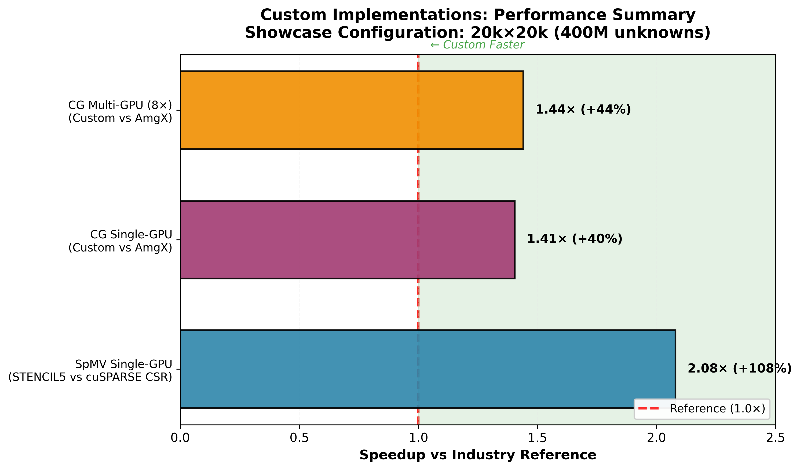

# Multi-GPU Conjugate Gradient Solver

High-performance multi-GPU Conjugate Gradient solver for large-scale sparse linear systems using CUDA and MPI. Optimized for structured stencil grids (5-point 2D, 7-point and 27-point 3D) with strong scaling efficiency across 1–8 GPUs.

This project evaluates GPU sparse matrix–vector multiplication strategies and their impact on iterative solvers, with a focus on stencil-structured workloads common in scientific computing (PDE discretizations, CFD, FEM).

## Key Numbers

| Metric | Result |
|--------|--------|
| **Stencil CG vs NVIDIA AmgX** | 1.40× faster (single-GPU), 1.44× faster (8 GPUs) |
| **Stencil SpMV vs cuSPARSE CSR** | 2.07× speedup on A100 80GB |
| **3D overlap (7pt/27pt)** | 88% scaling efficiency on 8 GPUs, up to 1.45× overlap gain |
| **Strong scaling efficiency** | 87–94% (2D), 88% (3D 27pt overlap) from 1→8 GPUs |
| **Problem size tested** | Up to 400M unknowns (2D 20k×20k), 134M unknowns (3D 512³) |

**Hardware**: 8× NVIDIA A100-SXM4-80GB · CUDA 12.8 · Driver 575.57

## Where to Go Next

**[Results](results.md)** — All benchmark tables in one place: 2D strong scaling, detailed 1/2/4/8-GPU breakdowns, SpMV format comparison, AmgX comparison, and 3D 7-point/27-point overlap results.

**[Why It's Faster — 2D Analysis](profiling-2d.md)** — Kernel-level profiling that explains the speedup over NVIDIA AmgX: SpMV kernel breakdown, roofline analysis, and speedup attribution.

**[Compute-Communication Overlap — 3D Analysis](profiling-3d.md)** — How interior/boundary decomposition and dual-stream execution hide MPI halo exchange behind GPU computation, reaching 88% strong scaling efficiency on 8 GPUs.

**[Reproducing the Results](reproducing.md)** — Build the solver, run the benchmark suite, and profile on your own hardware.

**[Methodology](methodology.md)** — Measurement protocol: timing scope, statistical approach, reproducibility conditions, profiling tools.

## At a Glance

