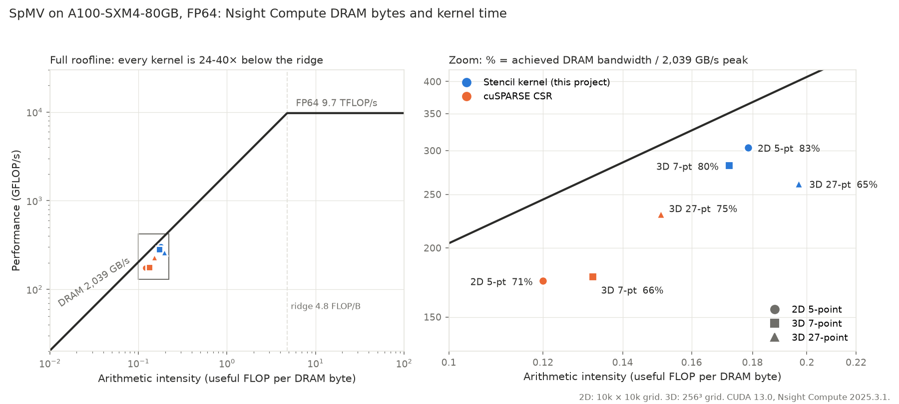

# Profiling Analysis: Why Stencil Specialization Wins

This document explains **why** the custom CG solver outperforms NVIDIA AmgX, using profiling data from Nsight Systems and Nsight Compute. Both sides run unpreconditioned CG, so the speedup reflects implementation efficiency on the same algorithm, not an algorithmic difference.

> **Hardware note.** Performance numbers in this document (solver timings, kernel breakdowns, SpMV throughput) were measured on 8× NVIDIA A100-SXM4-80GB (NVLink NV12). The SpMV roofline in [section 2](#2-spmv-kernel-analysis) was profiled with Nsight Compute on the same GPU model, with DRAM bytes measured per kernel. The 4k×4k Nsight Systems timelines in [section 3](#3-multi-gpu-scaling-analysis) come from an earlier run on 2× A100-SXM4-40GB.

## Executive Summary

| Finding | Impact |
|---------|--------|
| AmgX spends **48% of compute time** in generic CSR SpMV | Primary optimization target |
| Custom stencil SpMV is **2.08× faster** than the cuSPARSE CSR of CUDA 12.8 (1.84× against CUDA 13.0) | Moves 33% fewer bytes and reaches 83% of DRAM peak |
| Stencil-aware halo exchange: **one boundary row per neighbor** (N × 8 bytes) | Minimal communication overhead |
| Overall solver speedup: **1.41× single-GPU, 1.44× multi-GPU** | Consistent advantage at scale |

**Key insight**: By exploiting the known 5-point stencil structure, the custom solver removes the index indirection that dominates AmgX's SpMV (the primary source of the 2D solver speedup) and reduces halo communication to one boundary row per neighbor (a design property whose measurable payoff appears at scale; see [`profiling-3d.md`](profiling-3d.md)).

---

## 1. Kernel Distribution (Single-GPU)

### AmgX Kernel Breakdown (10k×10k, 1 GPU)

| Kernel Type | Time % | Notes |
|-------------|-------:|-------|
| cuSPARSE CSR SpMV | 48% | Generic sparse matrix-vector multiply |
| AXPY | 19% | Vector addition |
| Dot product | 10% | Inner product reductions |
| AXPBY | 9% | Scaled vector operations |
| Other | 14% | Setup, synchronization, etc. |

### Custom CG Kernel Breakdown (10k×10k, 1 GPU)

| Kernel Type | Time % | Notes |
|-------------|-------:|-------|
| Stencil SpMV | 41% | Stencil-aware kernel |
| AXPY | 29% | Vector addition |
| Dot product (cuBLAS) | 16% | cuBLAS ddot |
| AXPBY | 13% | Scaled vector operations |

*Both breakdowns measured on a single A100-SXM4-80GB to isolate kernel-level distribution from communication overhead. Multi-GPU scaling is analyzed separately in [section 3](#3-multi-gpu-scaling-analysis).*

### Observation

SpMV dominates in both implementations (~40-50% of total time), making it the primary optimization target. The custom kernel's 2× speedup on this operation drives the overall solver improvement.

---

## 2. SpMV Kernel Analysis

### Why Stencil Kernels Are Faster

The 5-point stencil discretization produces a sparse matrix with a **predictable structure**:

```
     [N]
      |
[W]--[C]--[E]
      |
     [S]
```

Each interior row has exactly 5 non-zeros at fixed offsets: `-grid_size`, `-1`, `0`, `+1`, `+grid_size`.

**Generic CSR (cuSPARSE)**:

- Must read `col_idx[]` array for every non-zero
- Indirect memory accesses → cache misses
- Cannot predict next memory location

**Stencil-aware kernel (custom)**:

- Column indices computed from row index (no lookup)
- Grouped memory accesses: W-C-E (stride-1) before N-S (stride grid_size)
- Every row except the grid boundary uses the fast path (99.96% of rows at 10k×10k)

### Measured Performance (A100-SXM4-80GB)

Single GPU, 10k×10k grid (100M rows, 500M non-zeros), FP64, median of 10 runs. DRAM bytes are measured
with Nsight Compute (`dram__bytes_read.sum + dram__bytes_write.sum`); bandwidth is those bytes divided by
the benchmark's own kernel time.

| Implementation | Time | DRAM bytes / row | Achieved bandwidth | % of 2,039 GB/s peak | Stencil speedup |
|----------------|-----:|-----------------:|-------------------:|---------------------:|----------------:|
| cuSPARSE CSR, CUDA 12.8 | 6.80 ms | 83.8 | 1,232 GB/s | 60% | **2.05×** |
| cuSPARSE CSR, CUDA 13.0 | 6.10 ms | 83.3 | 1,367 GB/s | 67% | **1.84×** |
| Stencil kernel | 3.31 ms | 56.0 | 1,690 GB/s | **83%** | — |

The cuSPARSE version matters: the same matrix, on the same GPU, runs 11% faster with the cuSPARSE of
CUDA 13.0 (a shorter partitioning pass and a faster `csrmv` kernel at equal bytes). The stencil kernel
runs in the same 3.31 ms whichever toolkit compiles it. Times are medians over a rotation of 3 builds ×
3 GPUs; GPU-to-GPU variation stays below 1%.

### Roofline Analysis (Nsight Compute)



Every point is placed from measured DRAM bytes and kernel time (Nsight Compute, GPU clocks left
unlocked), with the useful work of the operator (2 × nnz FLOPs) on both sides. The 3D points use the
same kernels as the 3D solver, at 256³.

| Operator | Kernel | DRAM bytes / row | Time | % of DRAM peak | Arithmetic intensity |
|----------|--------|-----------------:|-----:|---------------:|---------------------:|
| 2D 5-point | Stencil | 56.0 | 3.29 ms | 83% | 0.179 FLOP/B |
| 2D 5-point | cuSPARSE CSR | 83.3 | 5.74 ms | 71% | 0.120 FLOP/B |
| 3D 7-point | Stencil | 81.1 | 0.83 ms | 80% | 0.172 FLOP/B |
| 3D 7-point | cuSPARSE CSR | 105.6 | 1.32 ms | 66% | 0.132 FLOP/B |
| 3D 27-point | Stencil | 272.1 | 3.44 ms | 65% | 0.197 FLOP/B |
| 3D 27-point | cuSPARSE CSR | 355.6 | 3.91 ms | 75% | 0.151 FLOP/B |

<sub>CUDA 13.0. Kernel times here are Nsight Compute's (`gpu__time_duration`); cuSPARSE rows include its
partitioning kernel. Under the profiler, write traffic after the first launch varies by up to 9 B/row
while read traffic is stable to 0.1 B; values are medians over all profiled launches. For cuSPARSE these
kernel-only times are shorter than the benchmark's own timing (5.74 against 6.10 ms), hence 71% of peak here
against 67% in the table above.</sub>

**Key observations:**

- Every kernel is **memory-bound**, 24-40× below the ridge point (4.8 FLOP/B): no compute unit,
  tensor cores included, can speed up this operation. Only bytes and bandwidth can.
- The 2D speedup has **two factors that multiply**: the stencil kernel moves **1.49× fewer bytes**
  (83.3 → 56.0 B/row) and reaches **1.24× higher bandwidth** (1,690 against 1,367 GB/s). 1.49 × 1.24 = 1.84.
- The same holds in 3D 7-point (81 against 106 B/row, 80% against 66% of peak).
- The 3D 27-point row-major kernel is the exception: **only 1.14× faster than cuSPARSE**, at 65% of
  peak. Reading 27 coefficients per row across the lanes of a warp is not coalesced, and it costs twice:
  the kernel moves 272 B/row where 240 would do, because the input vector is evicted and fetched again
  from DRAM, and it reaches a lower bandwidth.

### Arithmetic Intensity Analysis

Bytes per row, 2D 5-point, measured against the traffic each kernel must move at minimum:

| Metric | cuSPARSE CSR | Stencil |
|--------|-------------:|--------:|
| Coefficients (5 × 8 B) | 40 B | 40 B |
| Column indices (5 × 4 B) + row offset (4 B) | 24 B | none: computed from the row index |
| Input vector `x` (read once, reused from cache) + output `y` | 16 B | 16 B |
| **Minimum** | **80 B** | **56 B** |
| **Measured (Nsight Compute)** | **83.3 B** | **56.0 B** |
| Arithmetic intensity (10 FLOP per row) | 0.120 FLOP/B | 0.179 FLOP/B |

The stencil kernel moves **33% fewer bytes** per row by never loading index data. It reads exactly its
minimum; cuSPARSE reads 4% above its own.

---

## 3. Multi-GPU Scaling Analysis

### Communication Pattern Comparison

| Aspect | Custom CG | AmgX |
|--------|-----------|------|
| Halo exchange | One boundary row per neighbor (N × 8 bytes) | Generic CSR pattern |
| Method | MPI explicit staging | Internal MPI |
| Overlap | None (synchronous) | Internal optimization |

### Halo volume in practice (10k×10k on 8 GPUs)

In a concrete configuration:

- Each GPU owns ~12.5M rows
- Halo zone = 1 row = 10,000 doubles = 80 KB
- Two neighbors (top + bottom) = 160 KB total

Compare to naive AllGather: 100M doubles × 8 bytes = 800 MB (5000× more data).

### Scaling Efficiency

At 8 GPUs and 10k×10k, the custom CG achieves a 6.94× speedup vs AmgX's 6.99×: similar parallel efficiency. The custom solver's **single-GPU advantage (1.41× at 20k×20k) is maintained at scale**, reaching 1.44× at 8 GPUs (also 20k×20k; see [`results.md`](results.md#2d-custom-cg-vs-nvidia-amgx) for the per-size table).

Full Custom CG vs AmgX comparison table (10k/15k/20k, 1 GPU and 8 GPUs) in [`results.md`](results.md#2d-custom-cg-vs-nvidia-amgx).

### Timeline Comparison (Nsight Systems)

**Custom CG Solver** (4k×4k, 2× A100-SXM4-40GB):


**NVIDIA AmgX** (4k×4k, 2× A100-SXM4-40GB):


**Figure.** Nsight Systems timeline of one Conjugate Gradient iteration (2 MPI ranks, A100-SXM4-40GB). Top: custom CG using stencil-optimized CSR SpMV; bottom: NVIDIA AmgX under the same configuration. CUDA HW tracks show actual GPU kernel execution; MPI tracks highlight halo exchange phases. Annotations (green arrows, red rectangles) mark key phases: SpMV, halo exchange (DtoH → MPI → HtoD), and one full CG iteration. The AmgX iteration is approximately twice as long as the Custom CG, driven primarily by the longer cuSPARSE CSR SpMV kernel.

*NVTX ranges denote algorithmic phases and do not necessarily correspond to exact GPU kernel execution time; CUDA HW tracks provide the authoritative timing.*

**Key observation**: Performance gains come from a more efficient SpMV kernel and faster BLAS1 operations, not from compute-communication overlap (MPI halo exchange is synchronous in both implementations). The reduced communication volume of the stencil-aware exchange is a design property; its measurable impact appears at larger scale than the 4k×4k timeline shown here.

---

## Speedup Attribution

The custom CG's single-GPU advantage over AmgX (**1.41×** at both 10k×10k, the size of the kernel breakdowns above, and 20k×20k; see [`results.md`](results.md#2d-custom-cg-vs-nvidia-amgx)) comes from two measurable sources, not one:

- **SpMV specialization (primary).** The custom stencil SpMV runs **1.65× faster in-solver** than AmgX's cuSPARSE CSR SpMV (derived from the kernel breakdowns: 41% of custom time vs 48% of AmgX time, normalized by the 1.41× overall speedup). The isolated microbenchmark shows a larger 2.05× gain with the same CUDA 12.8 cuSPARSE; the in-solver figure is lower because cache state, launch patterns, and co-running operations differ from the isolated case.
- **A faster rest-of-solver (secondary).** The non-SpMV operations (AXPY, dot, AXPBY) are collectively **1.24× faster in-solver**. This is consistent with operating on partitioned local vectors with coalesced access rather than AmgX's library-level operations on global vectors, though this contribution is not isolated to a single mechanism in the current measurements.

Communication volume is a design property of the stencil-aware halo exchange (one boundary row per neighbor vs generic patterns), but at the single-GPU and small-multi-GPU sizes profiled here it is not a measurable driver of the 2D speedup. Its impact appears at larger scale and is the central mechanism of the 3D overlap solver (see [`profiling-3d.md`](profiling-3d.md)).

### Theoretical vs Observed

Using Amdahl's Law with SpMV at 48% of AmgX time and the isolated 2× SpMV speedup, the predicted solver speedup if SpMV were the only optimization would be:

```
Theoretical (SpMV-only) speedup = 1 / (0.48/2 + 0.52) = 1.32×
```

The observed 1.41× exceeds this SpMV-only prediction. The gap is not measurement noise: it reflects the faster rest-of-solver quantified above (1.24× in-solver). In other words, the speedup has two contributors (a large gain on SpMV and a smaller but real gain on the BLAS1 operations), and the simple SpMV-only Amdahl model captures only the first.

---

## Methodology

### Profiling Tools

**Nsight Systems** (timeline analysis):
```bash
# Custom CG (1 GPU)
nsys profile --trace=cuda,nvtx -o custom_1gpu \
    ./bin/cg_solver_mgpu_stencil matrix/stencil_10000x10000.mtx

# Custom CG (multi-GPU)
nsys profile --trace=cuda,mpi,nvtx -o custom_mgpu \
    mpirun -np 4 ./bin/cg_solver_mgpu_stencil matrix/stencil_10000x10000.mtx

# AmgX (1 GPU)
nsys profile --trace=cuda,nvtx -o amgx_1gpu \
    ./external/benchmarks/amgx/amgx_cg_solver matrix/stencil_10000x10000.mtx
```

**Nsight Compute** (kernel analysis):
```bash
# Both SpMV implementations in one report, clocks left to the GPU
ncu --set roofline --metrics dram__bytes_read.sum,dram__bytes_write.sum --clock-control none \
    -k regex:"csrmv_v3|csr_partition|stencil5_csr_direct" -o spmv_2d_10000_a100 \
    ./bin/spmv_bench matrix/stencil_10000x10000.mtx --mode=cusparse-csr,stencil5-csr

# DRAM bytes per row = (dram__bytes_read.sum + dram__bytes_write.sum) / rows
ncu -i spmv_2d_10000_a100.ncu-rep --csv --page raw \
    --metrics dram__bytes_read.sum,dram__bytes_write.sum,gpu__time_duration.sum
```

Use raw byte counts, not the percentage-of-peak figures: those are computed at the clocks Nsight Compute
imposes by default (`--clock-control base`), which change time but not bytes.

These commands document the profiling of this specific analysis. For general reproduction of the published numbers, see the [Reproducing](reproducing.md#profiling) page.

### Available Profile Data

| Profile | Location | Hardware |
|---------|----------|----------|
| Custom 1 GPU (10k) | `profiling/nsys/mpi_1ranks_profile_10000.nsys-rep` | A100-SXM4-80GB |
| Custom 2 GPUs (10k) | `profiling/nsys/mpi_2ranks_profile_10000.nsys-rep` | A100-SXM4-80GB |
| AmgX 1 GPU (10k) | `profiling/nsys/amgx_1ranks_profile_10000.nsys-rep` | A100-SXM4-80GB |
| AmgX 2 GPUs (10k) | `profiling/nsys/amgx_2ranks_profile_10000.nsys-rep` | A100-SXM4-80GB |
| SpMV roofline, cuSPARSE and stencil (10k) | `profiling/ncu/spmv_2d_10000_a100.ncu-rep` | A100-SXM4-80GB |

---

## Conclusions

1. **SpMV is the bottleneck**: 48% of AmgX time, making kernel optimization high-impact

2. **Structure exploitation works**: Eliminating index indirection yields a 2.08× SpMV speedup against the cuSPARSE of CUDA 12.8 (1.84× against CUDA 13.0): about 1.5× fewer bytes times 1.24-1.37× higher achieved bandwidth

3. **Gains compound at scale**: Single-GPU advantage (1.41×) maintained through 8 GPUs (1.44×)

4. **Not a limitation of AmgX**: AmgX correctly handles arbitrary sparse matrices; the performance gap reflects the value of specialization when problem structure is known
