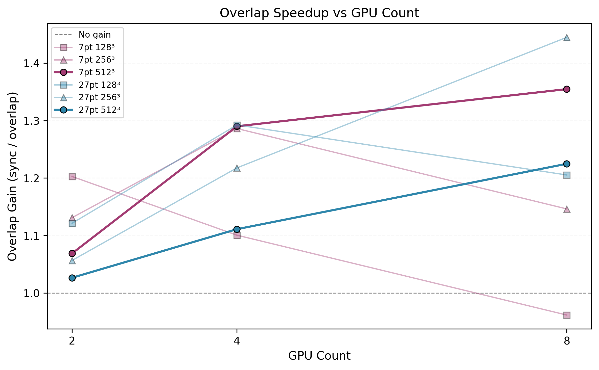

# 3D Stencil Extension: Compute-Communication Overlap

This document presents the 3D extension of the multi-GPU CG solver (7-point and 27-point stencils) with compute-communication overlap. The analysis demonstrates how interior/boundary decomposition and dual-stream execution hide MPI halo exchange behind GPU computation.

> **Hardware note.** All results in this document were measured on 8× NVIDIA A100-SXM4-80GB (NVLink NV12). Each configuration uses median of 10 runs with 3 warmups discarded. See [`profiling-2d.md`](profiling-2d.md) for the 2D analysis and methodology details.

**88% strong scaling efficiency on 8 A100 GPUs** (27-point stencil, 512³ grid, overlap solver).

This section extends the solver to realistic 3D stencils (7-point and 27-point) with compute-communication overlap via interior/boundary decomposition and dual-stream execution. Each SpMV is split into interior rows (independent of halo data) computed on `stream_compute`, while halo exchange (D2H + MPI + H2D) runs concurrently on `stream_comm`. Boundary rows are computed after halo arrival.

#### Nsight Systems Timeline — Sync vs Overlap


*7-point stencil, 512³, 4 GPUs, Rank 2. One CG iteration takes 4.82 ms. The sequence is strictly serial: SpMV kernel, dot products, then `Halo_Exchange_MPI_3D` (1.57 ms). The red rectangle marks the halo exchange phase: the [All Streams] row is empty during this 1.57 ms window — the GPU sits idle while waiting for MPI communication to complete.*


*Same configuration with `--overlap`. One CG iteration takes 3.76 ms (1.28× faster). The red rectangle marks the overlap phase: the interior SpMV kernel (`stencil7_overlap_subrange_kernel_3d`) runs concurrently with halo D2H memcpy, MPI interprocess communication (`process_vm_readv` on the OS runtime libraries row), and `MPI_Waitall` — all visible inside the rectangle. After the rectangle, H2D memcpy completes and small boundary SpMV kernels execute. The 4.82 → 3.76 ms reduction matches the benchmark table.*

```
stream_compute: |--- interior SpMV ---|                  |-- boundary SpMV --|
stream_comm:    |-- D2H --|-- MPI --|-- H2D --|
                                              ↑ sync point
```

### 7-Point Stencil — Sync vs Overlap

**Hardware**: 8× NVIDIA A100-SXM4-80GB (NVLink)

| Grid | GPUs | Sync (ms) | Overlap (ms) | Overlap Gain | Iterations |
|------|------|-----------|--------------|--------------|------------|
| 128³ | 1 | 73.2 | 74.0 | — | 261 |
| 128³ | 2 | 52.8 | 43.9 | 1.20× | 261 |
| 128³ | 4 | 51.4 | 46.7 | 1.10× | 261 |
| 128³ | 8 | 47.8 | 49.7 | 0.96× | 261 |
| 256³ | 1 | 970.3 | 972.4 | — | 527 |
| 256³ | 2 | 583.3 | 515.7 | 1.13× | 527 |
| 256³ | 4 | 409.0 | 318.0 | 1.29× | 527 |
| 256³ | 8 | 304.7 | 265.8 | 1.15× | 527 |
| 512³ | 1 | 15127 | 15129 | — | 1065 |
| 512³ | 2 | 8211 | 7682 | 1.07× | 1065 |
| 512³ | 4 | 5088 | 3944 | 1.29× | 1065 |
| 512³ | 8 | 3323 | 2453 | 1.36× | 1065 |

<sub>1-GPU rows show no overlap gain (no communication to hide). 128³/8GPU shows slight overhead (0.96×): per-GPU workload is too small for dual-stream overhead to pay off.</sub>

### 27-Point Stencil — Sync vs Overlap

| Grid | GPUs | Sync (ms) | Overlap (ms) | Overlap Gain | Iterations |
|------|------|-----------|--------------|--------------|------------|
| 128³ | 1 | 89.2 | 89.6 | — | 151 |
| 128³ | 2 | 57.3 | 51.1 | 1.12× | 151 |
| 128³ | 4 | 47.3 | 36.6 | 1.29× | 151 |
| 128³ | 8 | 40.5 | 33.6 | 1.21× | 151 |
| 256³ | 1 | 1315.4 | 1315.4 | — | 303 |
| 256³ | 2 | 718.9 | 680.3 | 1.06× | 303 |
| 256³ | 4 | 447.5 | 367.5 | 1.22× | 303 |
| 256³ | 8 | 294.0 | 203.5 | 1.45× | 303 |
| 512³ | 1 | 22016 | 21997 | — | 611 |
| 512³ | 2 | 11438 | 11142 | 1.03× | 611 |
| 512³ | 4 | 6461 | 5815 | 1.11× | 611 |
| 512³ | 8 | 3809 | 3110 | 1.23× | 611 |

### Strong Scaling Efficiency (overlap solver)

<p align="center">
  
</p>

**7-point stencil** — speedup relative to 1-GPU sync baseline:

| Grid | 1 GPU | 2 GPUs | 4 GPUs | 8 GPUs |
|------|-------|--------|--------|--------|
| 128³ | 1.00× | 1.69× | 1.59× | 1.49× |
| 256³ | 1.00× | 1.88× | 3.06× | 3.66× |
| 512³ | 1.00× | 1.97× | 3.84× | 6.17× |

<sub>512³ at 8 GPUs: 15127/2453 = 6.17× → 77% parallel efficiency</sub>

**27-point stencil** — speedup relative to 1-GPU sync baseline:

| Grid | 1 GPU | 2 GPUs | 4 GPUs | 8 GPUs |
|------|-------|--------|--------|--------|
| 128³ | 1.00× | 1.75× | 2.44× | 2.66× |
| 256³ | 1.00× | 1.93× | 3.58× | 6.47× |
| 512³ | 1.00× | 1.98× | 3.79× | 7.08× |

<sub>512³ at 8 GPUs: 22016/3110 = 7.08× → **88% parallel efficiency**</sub>

<details>
<summary><b>📊 Overlap Gain by Configuration</b></summary>

<p align="center">
  
</p>

</details>

### Key Observations

Overlap gain scales with both GPU count and problem size. Larger grids have a larger interior region relative to the halo boundary, giving `stream_compute` more work to hide behind halo exchange. The 27-point stencil benefits more than the 7-point stencil at the same grid size because it is more compute-intensive (27 vs 7 loads per row), which extends interior computation time and increases the fraction of communication that can be masked. Best overlap gains are 1.45× (27pt, 256³, 8 GPUs) and 1.36× (7pt, 512³, 8 GPUs).

Small workloads show diminishing returns. At 128³ on 8 GPUs the per-GPU workload is too brief to mask halo exchange latency, and the 7pt/128³/8GPU case incurs slight overhead (0.96×) from dual-stream management. 1-GPU runs confirm zero overhead: sync and overlap times are equivalent with no communication to hide.

The best scaling result — 88% parallel efficiency on 8 GPUs (27pt, 512³, overlap) — comes from combining kernel specialization with communication hiding. The Nsight timelines above show how a 4.82 ms synchronous iteration (GPU idle during halo exchange) becomes a 3.76 ms overlapped iteration, matching the 1.28× gain in the benchmark table.

### How to Reproduce

```bash
# Generate matrices
./bin/generate_matrix_3d 256 matrix/stencil3d_256.mtx
./bin/generate_matrix_3d_27pt 256 matrix/stencil3d_27pt_256.mtx

# Run sync solver
mpirun -np 8 ./bin/cg_solver_mgpu_stencil_3d matrix/stencil3d_27pt_256.mtx --stencil=27

# Run overlap solver
mpirun -np 8 ./bin/cg_solver_mgpu_stencil_3d matrix/stencil3d_27pt_256.mtx --stencil=27 --overlap

# Verify correctness
mpirun -np 8 ./bin/cg_solver_mgpu_stencil_3d matrix/stencil3d_27pt_256.mtx --stencil=27 --overlap --verify
```
