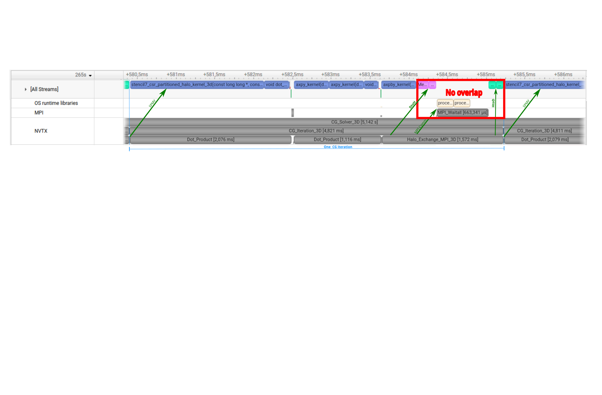
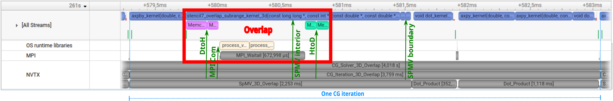
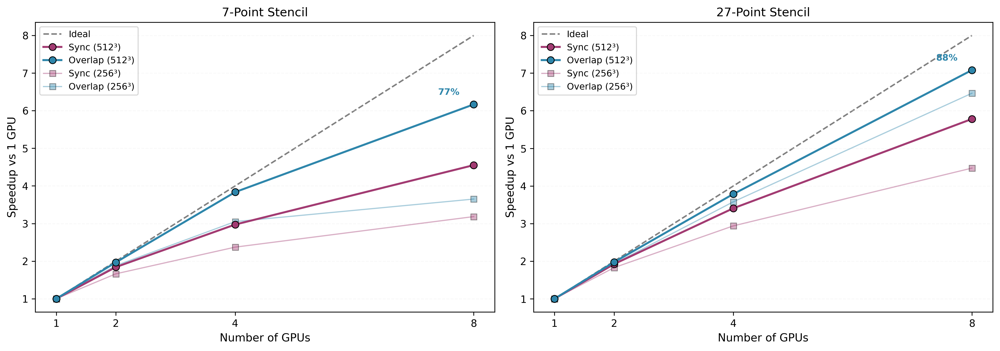

# 3D Stencil Extension: Compute-Communication Overlap

This document presents the 3D extension of the multi-GPU CG solver (7-point and 27-point stencils) with compute-communication overlap. The analysis demonstrates how interior/boundary decomposition and dual-stream execution hide MPI halo exchange behind GPU computation.

> **Hardware note.** All results in this document were measured on 8× NVIDIA A100-SXM4-80GB (NVLink NV12). Each configuration uses median of 10 runs with 3 warmups discarded. See [`profiling-2d.md`](profiling-2d.md) for the 2D analysis and methodology details.

**88% strong scaling efficiency on 8 A100 GPUs** (27-point stencil, 512³ grid, overlap solver).

This section extends the solver to realistic 3D stencils (7-point and 27-point) with compute-communication overlap via interior/boundary decomposition and dual-stream execution. Each SpMV is split into interior rows (independent of halo data) computed on `stream_compute`, while halo exchange (D2H + MPI + H2D) runs concurrently on `stream_comm`. Boundary rows are computed after halo arrival.

#### Nsight Systems Timeline — Sync vs Overlap



*7-point stencil, 512³, 4 GPUs, Rank 2. One CG iteration takes 4.82 ms. The sequence is strictly serial: SpMV kernel, dot products, then `Halo_Exchange_MPI_3D` (1.57 ms). The red rectangle marks the halo exchange phase: the [All Streams] row is empty during this 1.57 ms window — the GPU sits idle while waiting for MPI communication to complete.*



*Same configuration with `--overlap`. One CG iteration takes 3.76 ms (1.28× faster). The red rectangle marks the overlap phase: the interior SpMV kernel (`stencil7_overlap_subrange_kernel_3d`) runs concurrently with halo D2H memcpy, MPI interprocess communication (`process_vm_readv` on the OS runtime libraries row), and `MPI_Waitall` — all visible inside the rectangle. After the rectangle, H2D memcpy completes and small boundary SpMV kernels execute. The 4.82 → 3.76 ms reduction matches the 7-point 512³/4-GPU result in [`results.md`](results.md#3d--7-point-stencil-sync-vs-overlap).*

```
stream_compute: |--- interior SpMV ---|                  |-- boundary SpMV --|
stream_comm:    |-- D2H --|-- MPI --|-- H2D --|
                                              ↑ sync point
```

### 7-Point Stencil — Sync vs Overlap

Representative results (full table for all 12 configurations in [`results.md`](results.md#3d--7-point-stencil-sync-vs-overlap)):

| Grid | GPUs | Sync (ms) | Overlap (ms) | Overlap Gain |
|------|------|-----------|--------------|--------------|
| 512³ | 8 | 3323 | 2453 | 1.36× |
| 256³ | 4 | 409.0 | 318.0 | 1.29× |
| 128³ | 8 | 47.8 | 49.7 | 0.96× |

Best gain: 1.36× (512³, 8 GPUs). The 128³/8-GPU case shows slight overhead — per-GPU workload too small for dual-stream to pay off.

### 27-Point Stencil — Sync vs Overlap

Representative results (full table for all 12 configurations in [`results.md`](results.md#3d--27-point-stencil-sync-vs-overlap)):

| Grid | GPUs | Sync (ms) | Overlap (ms) | Overlap Gain |
|------|------|-----------|--------------|--------------|
| 256³ | 8 | 294.0 | 203.5 | 1.45× |
| 512³ | 8 | 3809 | 3110 | 1.23× |
| 128³ | 4 | 47.3 | 36.6 | 1.29× |

Best gain: 1.45× (256³, 8 GPUs).

### Strong Scaling Efficiency (overlap solver)

<p align="center">
  
</p>

At 512³ on 8 GPUs: the 7-point stencil reaches 6.17× speedup (77% parallel efficiency) and the 27-point stencil reaches 7.08× speedup (**88% parallel efficiency**) relative to the 1-GPU sync baseline.

Full per-grid efficiency tables (7-point and 27-point, all GPU counts) are in [`results.md`](results.md#3d--strong-scaling-efficiency-overlap-solver).

### Key Observations

Overlap gain scales with both GPU count and problem size. Larger grids have a larger interior region relative to the halo boundary, giving `stream_compute` more work to hide behind halo exchange. The 27-point stencil benefits more than the 7-point stencil at the same grid size because it is more compute-intensive (27 vs 7 loads per row), which extends interior computation time and increases the fraction of communication that can be masked. Best overlap gains are 1.45× (27pt, 256³, 8 GPUs) and 1.36× (7pt, 512³, 8 GPUs).

Small workloads show diminishing returns. At 128³ on 8 GPUs the per-GPU workload is too brief to mask halo exchange latency, and the 7pt/128³/8GPU case incurs slight overhead (0.96×) from dual-stream management. 1-GPU runs confirm zero overhead: sync and overlap times are equivalent with no communication to hide.

The best scaling result — 88% parallel efficiency on 8 GPUs (27pt, 512³, overlap) — comes from combining kernel specialization with communication hiding. The Nsight timelines above show how a 4.82 ms synchronous iteration (GPU idle during halo exchange) becomes a 3.76 ms overlapped iteration — a 1.28× gain (see the 7-point 512³/4-GPU row in [`results.md`](results.md#3d--7-point-stencil-sync-vs-overlap)).

### How to Reproduce

```bash
# Generate matrices
./bin/generate_matrix_3d 256 matrix/stencil3d_256.mtx
./bin/generate_matrix_3d_27pt 256 matrix/stencil3d_27pt_256.mtx

# Run sync solver
mpirun -np 8 ./bin/cg_solver_mgpu_stencil_3d matrix/stencil3d_27pt_256.mtx --stencil=27

# Run overlap solver
mpirun -np 8 ./bin/cg_solver_mgpu_stencil_3d matrix/stencil3d_27pt_256.mtx --stencil=27 --overlap

# Verify correctness
mpirun -np 8 ./bin/cg_solver_mgpu_stencil_3d matrix/stencil3d_27pt_256.mtx --stencil=27 --overlap --verify
```
